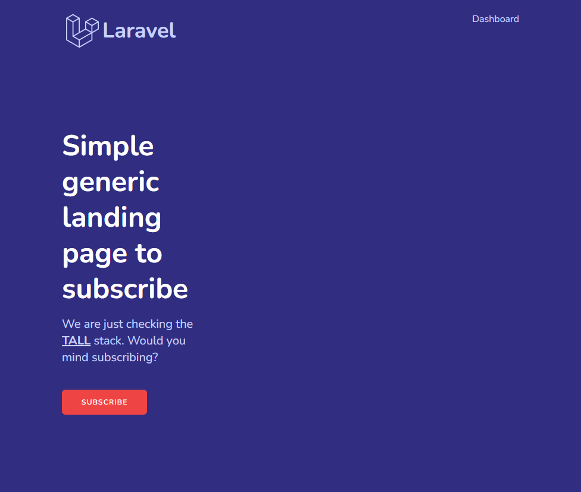
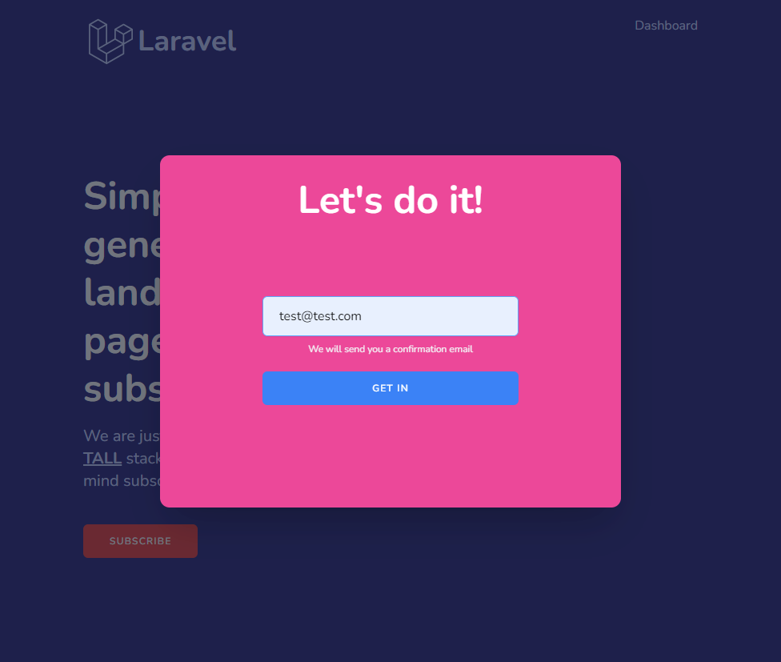
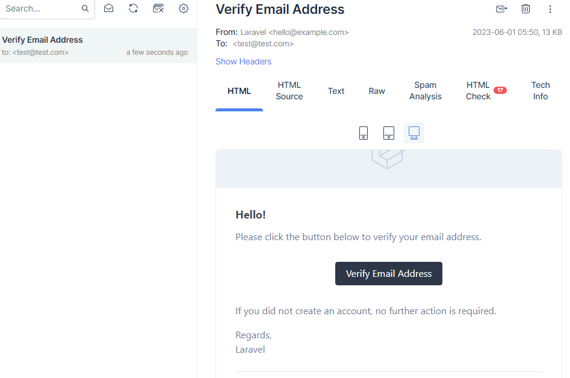
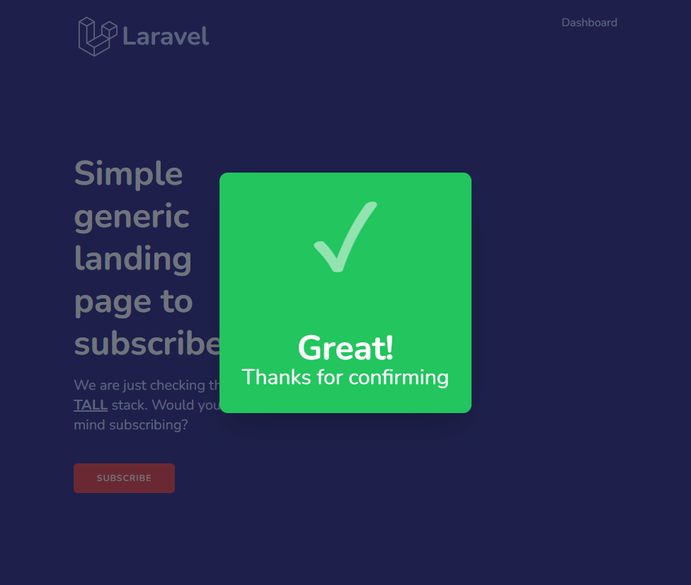
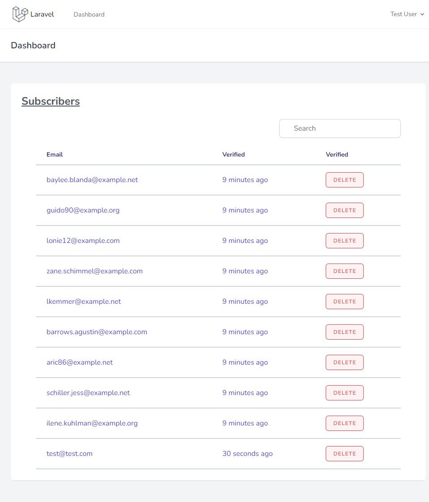
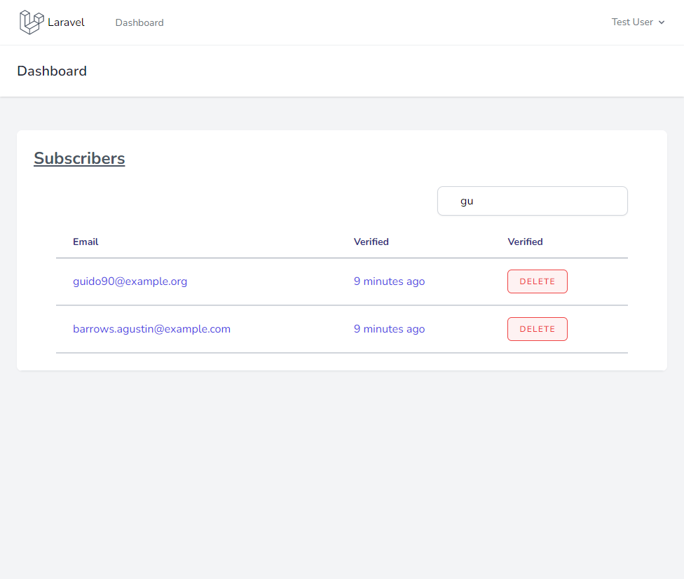

# TALL Stack (Tailwind CSS, Apline JS, Laravel, Livewire) Landing Page

Simple Landing Page made up of Tailwind CSS, Alpine.js, Livewire, and Laravel.

It was created a subscriber system with a nice appearance thanks to Tailwind, dynamic and reactive thanks to Livewire and Alpine.js, and perfectly functional and supported thanks to Laravel. Dashboard, which will allow you to manage that list of subscribers also created, using Laravel Breeze.

Here are a few screenshots from the application:

Main Page

Subscription Form

Successful subscribtion

Verification Email

Email Verified

Dashboard

Live Search

---
## Install

If you want to run it locally you should do the following steps:

### Prerequisites

PHP (at least 8.0) and Composer should be installed to proceed. In addition, if you want email verification to work correctly, you must register with one of the services that provide a test SMTP server service, such as [Mailtrap](https://mailtrap.io/). Credentials (MAIL_USERNAME and MAIL_PASSWORD) should be passed to your .env file.

### Installation
    git clone git@github.com:deepydee/TALL-course.git
    cp .env.example .env
    touch database/database.sqlite
    composer install
    npm install
    php artisan key:generate
    php artisan migrate:fresh --seed
    npm run dev
    php artisan serve

Your project will be available by http://localhost:8000

Login: 'test@example.com', password: 'password'
